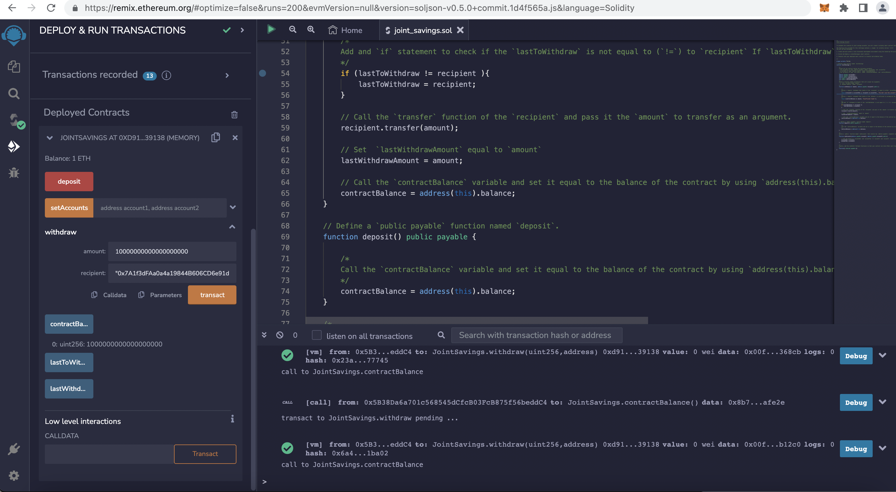

# Joint Savings Account Solidity Smart Contract

This project contains a Solidity smart contract that creates a joint savings account, which can be controlled by two user addresses. 

The smart contract uses ether management functions to implement financial institution requirements for the features of the joint savings account. These features include depositing and withdrawing funds from the account.

## Technologies

This project leverages the following technologies:

**Solidity**: for creating the Ethereum smart contract

**Remix**: Ethereum IDE, for compiling and deploying the Ethereum smart contract

## Installation

To use this project, simply clone the repository and run the `joint_savings.sol` file with Remix IDE.

## Usage

To use the Joint Account app, clone the repo and run the `joint_savings.sol` with Remix IDE

1. Create and work within a local blockchain development environment using the JavaScript VM provided by the Remix IDE.

2. Script and deploy a **JointSavings** smart contract.

3. Interact with your deployed smart contract to transfer and withdraw funds.

### Results

  

  

  
  
  
  
  
  
  

This project is intended for educational purposes only and should not be used in a production environment without further review and testing.
